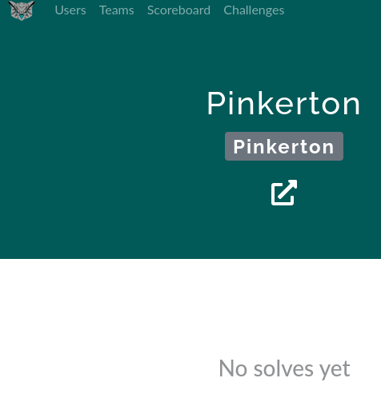
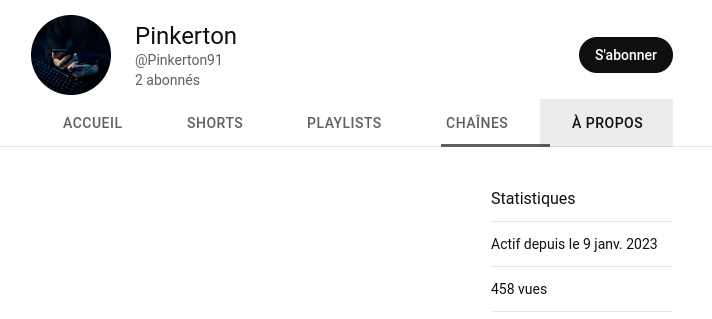

# The intruder

We suspect a detective to be investigating the same case as us. He has a bad habit of trying to retrieve our information, so he could be among you. We know that he regularly creates YouTube channels during these investigations. Can you find the ID of his current YouTube channel? Something that may help: he usually pay tribute to a detective born in 1819, using his name as 
pseudonym.

Format : HEXA{ID}

## Method

Allan Pinkerton seems to be our target. But lots of results on Youtube... Something really important :

> so he could be among you

What if Pinkerton was a player of the CTF ?



Pinkerton isn't good at solving challenges but there's a link to a Youtube channel!



## Solution

```
HEXA{UCjyLqrOsjkpsMhczlbHJoFA}
```
