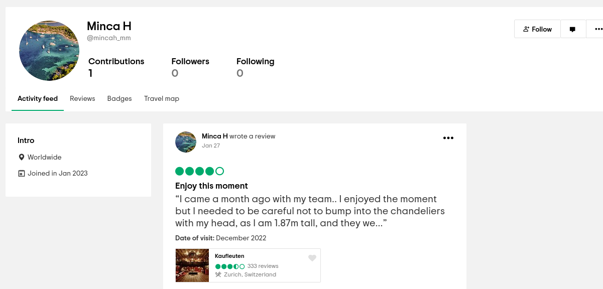

# Good time

We are progressing in the hunt thanks to
 your information. Keep going! The invitation that you have just found 
mentions a place for the meeting, can you help us to identify this 
place?

Format : HEXA{LocationName}

## Method


Remember the Google Calendar meeting. Tried those Protonmail nicknames on https://whatsmyname.app/. Only one result for `mincah_mm`, a restaurant in Zurich!



## Solution

```
HEXA{Kaufleuten}
```


