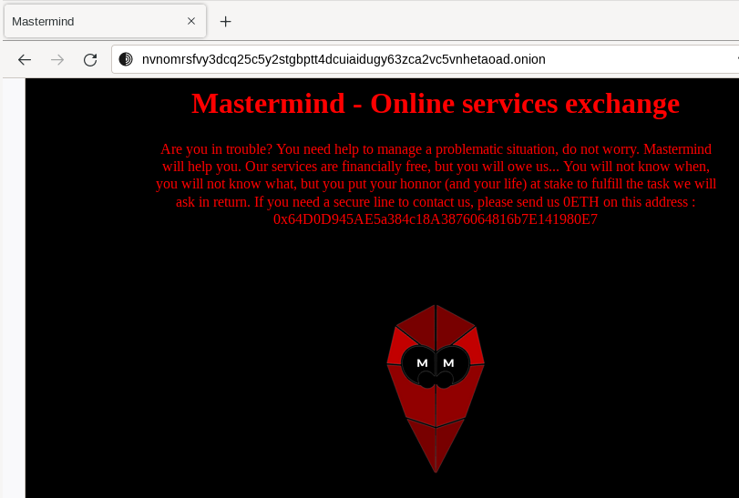

# Herbaceous

You found an email, that's great. Could you use this email to find interesting information?

Format : HEXA{you_will_know_this_is_a_flag}

## Method

Added this email to Google Agenda


```
Hi everyone, our meeting in Switzerland is coming soon. I will give you the meeting place at the last minute, this will be safer.

Our agenda for this meeting :
- Give the package all details about the mission, and explain her what is at stake for our contact in Asia ;
- Define the route you will follow and where to drop the package, which will allow us to conclude the mission ;

I will await you. O. will be with me, that will allow us to talk about the http://nvnomrsfvy3dcq25c5y2stgbptt4dcuiaidugy63zca2vc5vnhetaoad.onion/ site.

@Associate, you will be able to tell her what you need on that website.

I need you to confirm the appointment ASAP.

L.N.
```

- LN: like the owner of Nelexat?

Most interesting information for the moment: we have a link to a TOR website.



If we look at page source, we get the flag:

```html
</head>
<!--HEXA{N3l3x4t_is_L1nk3d_to_M4stermind}-->
<body>
```

This website also contain a bitcoin address and a link to another page where we can download a KMZ Google Earth file that will be used in latter challenges.

## Solution

```
HEXA{N3l3x4t_is_L1nk3d_to_M4stermind}
```
