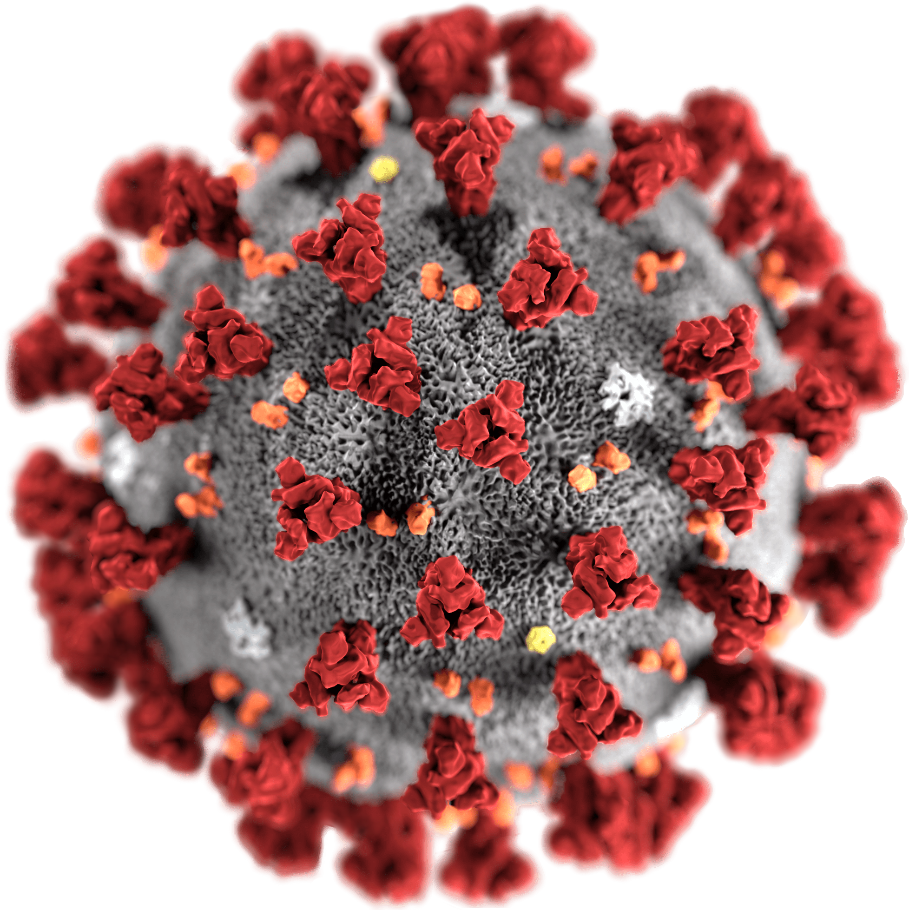

# Cov

Can you find anything odd about this image?

## Walkthrough

The idea was to use [Stegsolve](https://github.com/zardus/ctf-tools/blob/master/stegsolve/install) and to deep in the different layers. The alpha 0 layer gave us a QRcode which is the flag (decode with https://www.ginifab.com/feeds/qr_code/qr_code_scanner.html).

## Solution

`IceCTF{iwashedmyhandssomuchthisyearmyexamnotesfrom2007resurfaced}`

