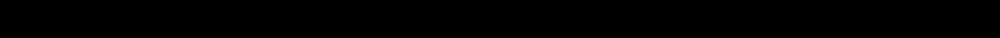

# Cruel

This message was transmitted to us but we can't see any message, can you find it?



## Walkthrough

Stegsolve again.

It we extract the LSB for RGB layers, we get a series of QRcodes representing each character of the flag. Bonus: little Python script to crop each QRcode:

```python
from PIL import Image
BASE=201
def crop(image_path, coords, saved_location):
    image_obj = Image.open(image_path)
    cropped_image = image_obj.crop(coords)
    cropped_image.save(saved_location)
    cropped_image.show()
if __name__ == '__main__':
    image = 'solved.png'
    for i in range(0,26):
        crop(image, (BASE*i+i, 0, BASE*(i+1)+i, 201), str(i)+'.png')
        print(str(BASE*i+i)+',0,'+str(BASE*(i+1)+i)+', 201')
```

## Solution

`IceCTF{this_font_is_QRuel}`