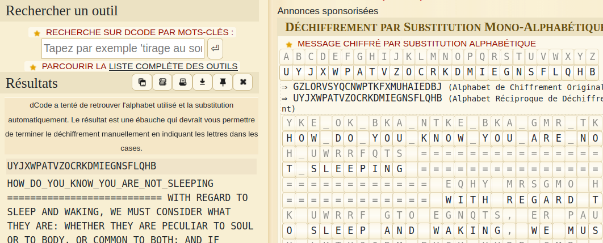

# crypto/Zzz

Oh no, somebody shuffled the alphabet, can you help us restore the  message? Note that the flag is not wrapped with flag{}, so you will have to do that yourself.

https://www.dcode.fr/substitution-monoalphabetique

A text with something that seems to be alphabetic substitution



## Flag

```
flag{HOW_DO_YOU_KNOW_YOU_ARE_NOT_SLEEPING}
```

