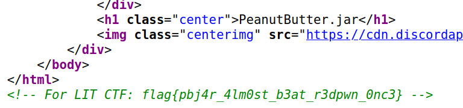

# misc/Peanutbutter.Jar

We would like to say a huge thank you to Rythm and Eyangch for their  massive support. Not only did they write many of the high quality  problems, but they also helped us greatly in the process of hosting CTF. They are from the team **PeanutButter.jar** and are actually hosting their own CTF competition in August. If you haven't already, you should definitely check out their website, https://pbjar.github.io/.

Source code:



## Flag

```
flag{pbj4r_4lm0st_b3at_r3dpwn_0nc3}
```

