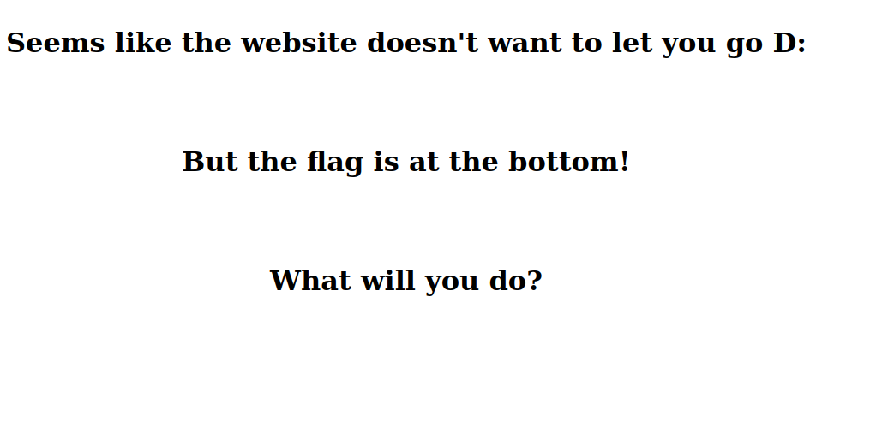

# web/Let It Go



Just had a look at the source code:

```html
<p style="font-size: 10px;">flag{l00k5_l1k3_y0u_f1n4lly_l3t_1t_g0}</p>
	<script>
```

## Flag

```
flag{l00k5_l1k3_y0u_f1n4lly_l3t_1t_g0}
```

