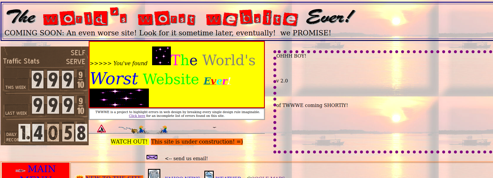
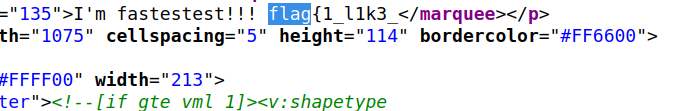
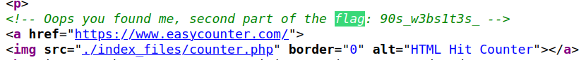
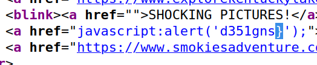

# web/My First Website

I just built [my first website](http://websites.litctf.live/)! I heard there might be a flag on it too



Website is just ugly ^^

Let's look for the flag in the source code again (knowing that flag format is `flag{...}`):





Unfortunately, nothing for the end of the flag... However, we know it ends by a `}`:




## Flag

```
flag{1_l1k3_90s_w3bs1t3s_d351gns}
```

