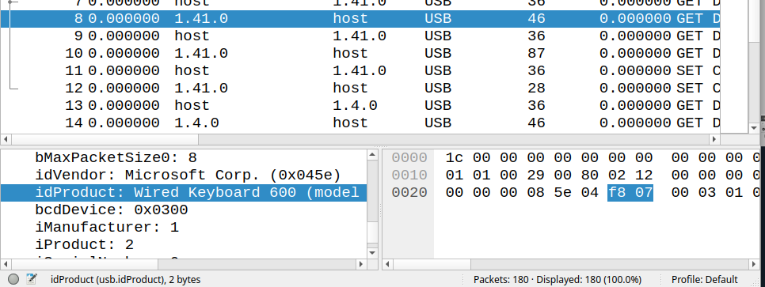
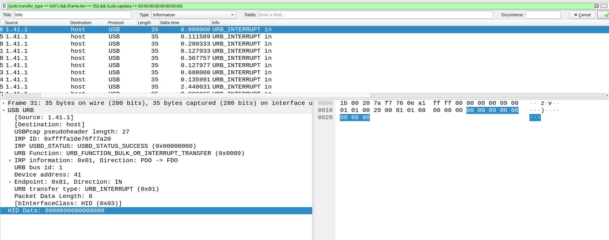

# Keyp it universal

> We intercepted a strange communication which we believe has important information inside. Can you retrieve the information from it? Flag format: flag{string} Regex: flag{[0-9a-z_]+}

Mostly inspired by https://abawazeeer.medium.com/kaizen-ctf-2018-reverse-engineer-usb-keystrok-from-pcap-file-2412351679f4

By looking at the first lines, we can see that several peripherals are connected. One is more interesting than others:



A USB Keyboard! By looking at the writeup above, we know that `URB_INTERRUPT` will represent keys pressed on the keyboard. The goal is to extract the HID data field on these packets.

First, let's filter a bit:

```
((usb.transfer_type == 0x01) && (frame.len == 35)) && !(usb.capdata == 00:00:00:00:00:00:00:00)
```



In this screenshot, there is the first packet `00 00 09 ...`. `0x09` is mapped to the letter `f` as shown in the Python script below:

HID data should be stored in `hexoutput.txt` ()

```python
newmap = {
2: "PostFail",
4:  "a", 5: "b", 6:  "c", 7:  "d",
8:  "e", 9: "f", 10: "g", 11: "h",
12: "i",13: "j", 14: "k", 15: "l",
16: "m",17: "n", 18: "o", 19: "p",
20: "q",21: "r", 22: "s", 23: "t",
24: "u",25: "v", 26: "w", 27: "x",
28: "y",29: "z",
30: "1",31: "2",32: "3",33: "4",34: "5",35: "6",36: "7",37: "8",38: "9",39: "0",
40: "Enter",
41: "esc",
42: "del",
43: "tab",
44: "space",
45: "_",
47: "{",
48: "}",
56: "/",
57: "CapsLock",
79: "RightArrow",
80: "LetfArrow"
}

myKeys = open('hexoutput.txt')
i = 1
for line in myKeys:
    bytesArray = bytearray.fromhex(line.strip())
for byte in bytesArray:
    if byte != 0:
        keyVal = int(byte)

if keyVal in newmap:
    print(newmap[keyVal])
else:
    print("No map found for this value: " + str(keyVal))
i+=1
```

## Flag

```
flag{usb_p4ck3t_c4ptur3_1s_fun}
```

