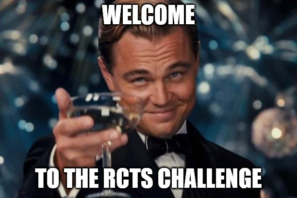

# Welcome to the challenge

> Welcome to the RCTS Challenge! Can you find the flag?



```bash
$ binwalk -D='.*' rcts_challenge.jpg 
DECIMAL       HEXADECIMAL     DESCRIPTION
--------------------------------------------------------------------------------
0             0x0             JPEG image data, JFIF standard 1.01
74737         0x123F1         PNG image, 400 x 200, 8-bit/color RGBA, non-interlaced
75273         0x12609         Zlib compressed data, best compression
$ cd _rcts_challenge.jpg.extracted 
```

One of the extracted files contains the flag!

## Flag

```
flag{0n3_1m4g3_1s_n0t_3n0ugh}
```

