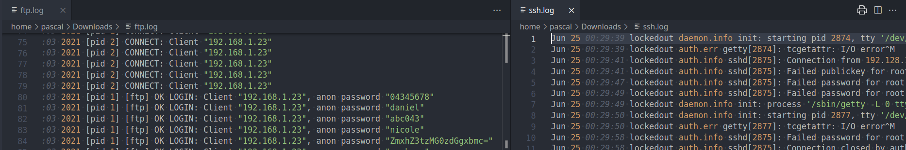

# Something suspicious

> We have detected a strange activity inside our network and manage to get some logs from it. Can you see what happened and if there was a host compromised?



Opened both files. Looks like FTP and SSH session logs.

First thing: there's something strange in the FTP log:

```
Fri Jun 25 03:52:03 2021 [pid 1] [ftp] OK LOGIN: Client "192.168.1.23", anon password "ZmxhZ3tzMG0zdGgxbmc="
```

There is a base64 string as one of the passwords. If we convert it:

```
flag{s0m3th1ng
```

It looks like the beginning of our flag! As for other challenges, flags are in [leet-speak](https://en.wikipedia.org/wiki/Leet) format. I guessed the whole flag: what if the flag was "something suspicious" written in leet-speak. It worked!

## Flag

```
flag{s0m3th1ng_susp1c10us}
```


