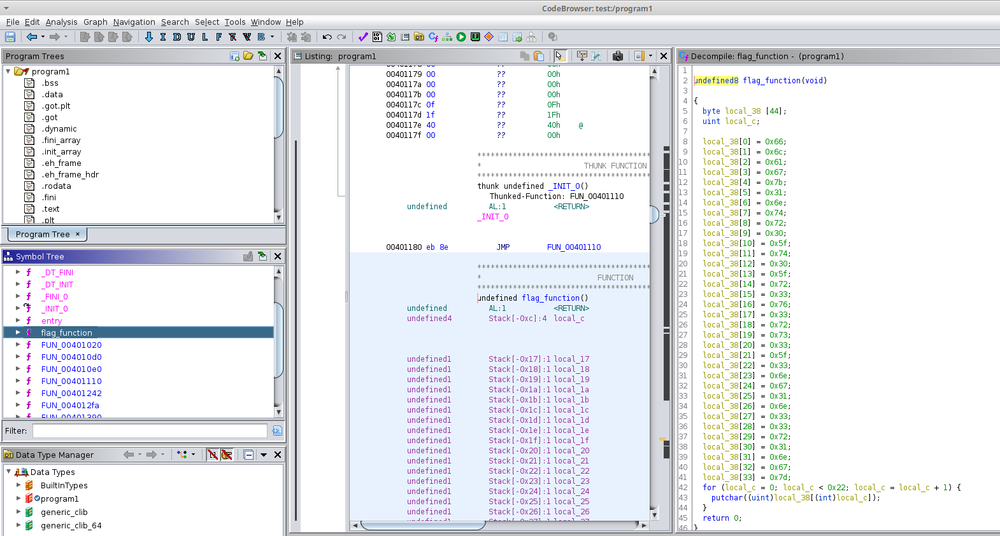

# You are not allowed

> Can you reverse this program and get us the flag?



```c
undefined8 flag_function(void)
{
  byte local_38 [44];
  uint local_c;
  
  local_38[0] = 0x66;   local_38[1] = 0x6c;   local_38[2] = 0x61;   local_38[3] = 0x67;
  local_38[4] = 0x7b;   local_38[5] = 0x31;   local_38[6] = 0x6e;   local_38[7] = 0x74;
  local_38[8] = 0x72;   local_38[9] = 0x30;   local_38[10] = 0x5f;  local_38[11] = 0x74;
  local_38[12] = 0x30;  local_38[13] = 0x5f;  local_38[14] = 0x72;  local_38[15] = 0x33;
  local_38[16] = 0x76;  local_38[17] = 0x33;  local_38[18] = 0x72;  local_38[19] = 0x73;
  local_38[20] = 0x33;  local_38[21] = 0x5f;  local_38[22] = 0x33;  local_38[23] = 0x6e;
  local_38[24] = 0x67;  local_38[25] = 0x31;  local_38[26] = 0x6e;  local_38[27] = 0x33;
  local_38[28] = 0x33;  local_38[29] = 0x72;  local_38[30] = 0x31;  local_38[31] = 0x6e;
  local_38[32] = 0x67;  local_38[33] = 0x7d;
  for (local_c = 0; local_c < 0x22; local_c = local_c + 1) {
    putchar((uint)local_38[(int)local_c]);
  }
  return 0;
}
```

This function is called in another function which seems to be the `main`:

```c
undefined8 main_function(void)
{
  int iVar1;
  char local_58 [64];
  char *local_18;
  int local_c;
  
  local_c = 0;
  puts("Enter the secret key : ");
  fgets(local_58,0x40,stdin);
  local_18 = (char *)FUN_00401242();
  iVar1 = strncmp(local_18,local_58,0xf);
  if (iVar1 == 0) {
    local_c = 1;
  }
  else {
    puts("Wrong key entered! Try again? ");
  }
  if (local_c != 0) {
    flag_function();
  }
  putchar(10);
  return 0;
}
```

```c
char * FUN_00401242(void)
{
  byte local_2f [15];
  char *local_20;
  char *local_18;
  ulong local_10;
  
  local_2f[0] = 0x53;
  local_2f[1] = 0x75;
  local_2f[2] = 0x70;
  local_2f[3] = 0x33;
  local_2f[4] = 0x72;
  local_2f[5] = 0x53;
  local_2f[6] = 0x33;
  local_2f[7] = 99;
  local_2f[8] = 0x72;
  local_2f[9] = 0x33;
  local_2f[10] = 0x74;
  local_2f[11] = 0x4b;
  local_2f[12] = 0x33;
  local_2f[13] = 0x79;
  local_2f[14] = 0x23;
  local_18 = (char *)malloc(4);
  local_20 = (char *)malloc(0x1f);
  for (local_10 = 0; local_10 < 0xf; local_10 = local_10 + 1) {
    sprintf(local_20,"%c",(ulong)local_2f[local_10]);
    strcat(local_18,local_20);
  }
  return local_18;
}
```

It copies a variable in `local_18` (`Sup3rS3cr3tK3y#`). It compares this key with the user input and prints the flag given in `flag_function` (hex to ASCII conversion needed).

## Flag

```
flag{1ntr0_t0_r3v3rs3_3ng1n33r1ng}
```


