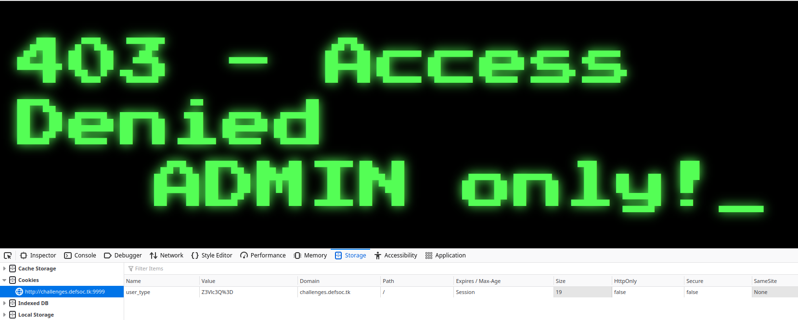
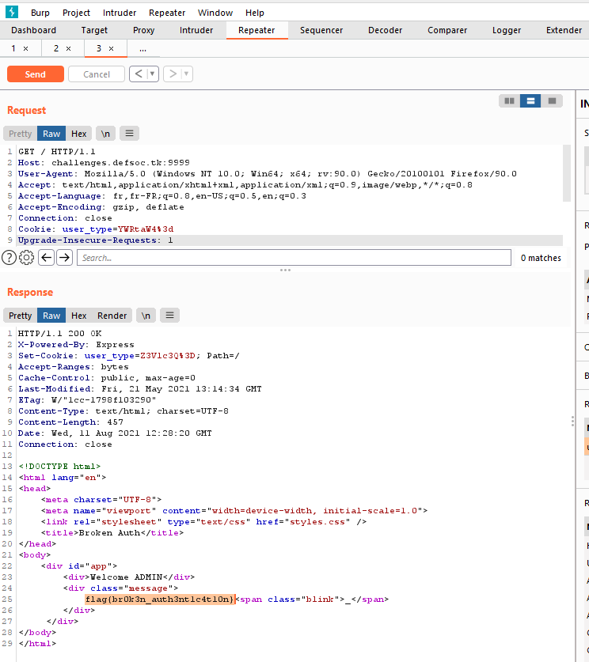

# Exclusive access

> We discovered a protected page. Can you bypass it? URL: http://challenges.defsoc.tk:9999



We can see an interesting cookie called `user_type` which value is `Z3Vlc3Q=` meaning `guest` in Base64!

What if we modify this cookie with the Base64 of `admin` with Burp Suite ?



Yep, we can see the flag!

## Flag

```
flag{br0k3n_auth3nt1c4t10n}
```

