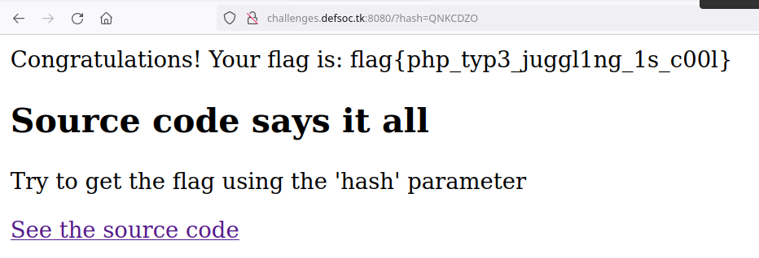

# Some type of juggling

> Can you solve this challenge? URL: http://challenges.defsoc.tk:8080

```php
<?php
    if(isset($_GET['source'])) {
        highlight_file(__FILE__);
        die();
    } else {
        $value = "240610708";
        if (isset($_GET['hash'])) {
            if ($_GET['hash'] === $value) {
                die('It is not THAT easy!');
            } 
            $hash = md5($_GET['hash']);
            $key = md5($value);
            if($hash == $key) {
                include('flag.php');
                print "Congratulations! Your flag is: $flag";
            } else {
                print "Flag not found!";
            }
        } 
    }
?> 
```

Rather simple, we need to find a value (not `240610708`) with the same hash. Found an answer on Stack Overflow: https://stackoverflow.com/questions/22140204/why-md5240610708-is-equal-to-md5qnkcdzo



## Flag

```
flag{php_typ3_juggl1ng_1s_c00l} 
```

