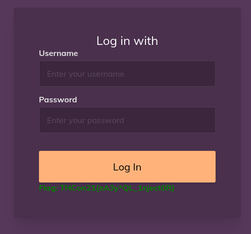

# SQL for dummies

> A lazy admin thinks is login page is secure, show him the contrary !

Let's try a simple SQL injection to get the flag:

- username : `test' or 1=1;--`
- password: anything...

Condition on the username is always true while `--` is a comment in SQL (this way, password is ignored)