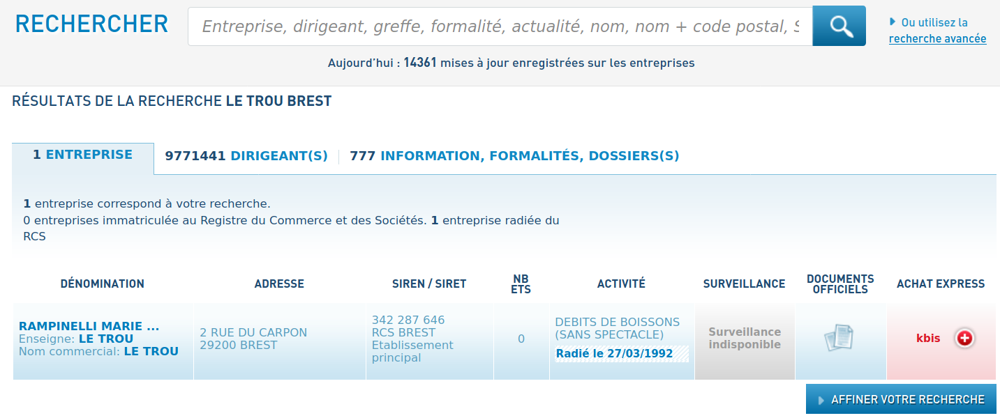

# La belle porte

## Challenge


Le voyageur temporel est passé par là, on cherche à retrouver le nom de la dernière propriétaire du commerce à cet endroit.

## Solution

On reconnait assez facilement la prison de Pontaniou https://fr.wikipedia.org/wiki/Prison_de_Pontaniou. Problème : la prison, bien qu'étant une ancienne fonderie, n'est pas un commerce en tant que tel. Deux solutions :

- Il y a eu effectivement un commerce à cet endroit.
- Sinon, ce n'est peut-être pas le sujet de la photo qu'il faut chercher mais le lieu depuis lequel la photo a été prise.

Partons sur cette deuxième option.

Un peu de géographie brestoise : en face de Pontaniou se trouve les ateliers des Capucins 


D'après la photo initiale, on serait à proximité de ce lieu, au rez-de-chaussée. Donc, pas directement un des commerces intégrés aux ateliers des Capucins. En se décalant un tout petit peu à droite sur Street View, on trouve un cadre qui ressemble fichtrement à la photo initiale...


Ca parait être le bon mais pas de trace de commerce à l'horizon... Cependant, on a affaire à un voyageur temporel, essayons de retourner dans le temps avec Google Street View (oui, c'est possible !)


Le cadre métallique était en fait le support d'une affiche d'un café/bar. C'est donc ce commerce qui nous intéresse !

Après une recherche rapide, on apprend que "Grappe Fleurie" est le nom d'une entreprise de spiritueux avec de bien jolis camions https://www.ouest-france.fr/bretagne/morlaix-29600/le-bistrot-de-lhistoire-revient-sur-les-vins-guevel-3796924


Pas trop d'informations de ce côté, c'est le "sponsor" habituel qu'on peut retrouver dans les débits de boissons.

Le nom du café/bar est donc le mot en rouge. Taggé, mais on devine qu'il s'agit du "Le Trou".

Pour information, le lieu en contrebas du cadre métallique est la fameuse rue de St-Malo, une très vieille rue de Brest. Une association est sur place pour essayer de la maintenir en état : http://www.vivrelarue.net/ (excellent source pour en savoir plus sur cette rue !).

Après une rapide recherche sur ce site, on en apprend plus sur "Le Trou" : http://www.vivrelarue.net/travaux/travaux.html

> ## 1992
>
> Après le départ en retraite de la propriètaire,  l'association est en transaction pour racheter le plus vieux bar de  Brest, "le Trou" situé en haut des escaliers de la Madeleine qui relie  la rue Saint Malo et la porte du Carpon.

Notre café/bar "Le Trou" a été détruit en 1992 suite au départ en retraite de notre cible !

http://arpetes-1967-1970.blogspot.com/2017/03/photos-darchives.html pour d'autres photos de ce bar :


Un tour rapide sur Infogreffe et on retrouve le nom de la propriétaire : https://www.infogreffe.fr/recherche-entreprise-dirigeants/resultats-entreprise-dirigeants.html?ga_cat=globale&ga_q=le%20trou%20brest#phrase=le%20trou%20brest

(rechercher "le trou brest" sur la [page d'accueil](https://www.infogreffe.fr/) si le lien ne renvoie rien, cf. https://github.com/pcotret/ctf-writeups/issues/1)



On est bons, le café est à la bonne adresse et a bien été fermé en 1992.

## Flag

```
UYBHYS{rampinelli}
```

