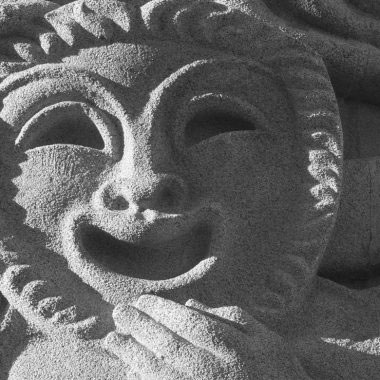

# Dell'arte



## Challenge

Je n'ai plus l'énoncé exact en tête mais ce n'est pas grave. **But :** retrouver l'endroit auquel fait penser cette photo.

## Solution

Cette gargouille/sculpture fait penser aux masques du carnaval de Venise et à la fameuse Commedia dell'Arte. Pour les amateurs de Brest, il y une galerie d'art qui s'appelle Le Comoedia dont voici la facade :


On retrouve le masque vénitien sur la facade qu'on retrouve également sur le site de la galerie https://www.artcomoedia.fr/un-lieu-charge-dhistoire/


## Flag

```
UYBHYS{comoedia}
```

