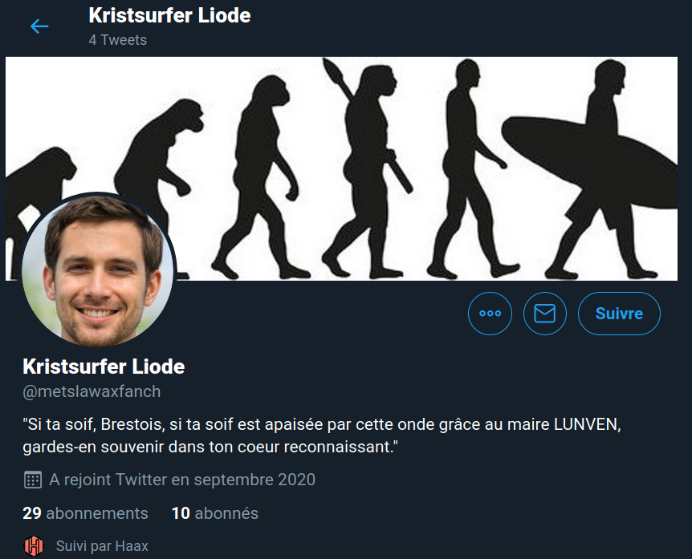

# Retrouver un compte Twitter

## Challenge

Suite directe du challenge [Dell'Arte](dellarte.md). Le voyageur temporel a été aperçu dans un rayon de 100m autour du Comoedia en train de twitter. Il faut retrouver son login Twitter.

## Solution

Si on utilise Twitter de manière "indélicate", on peut y laisser une trace de géolocalisation https://help.twitter.com/fr/safety-and-security/tweet-location-settings

Connaissant le lieu de départ (Le Comoedia, 35 rue Du Château), on peut chercher les tweets qui ont été géolocalisés dans un rayon de 100m autour de cet endroit avec un outil tel que https://www.i-resilience.fr/app/easygeotweets/#

Ce qui nous amène sur la page Twitter : https://twitter.com/search?q=near:%2248.385420493612344,-4.488403201103211%22%20within:0.1km%20&src=typed_query&f=live

Intéressant, voici la syntaxe générique à utiliser avec la position et le rayon:

```
near:"48.385420493612344,-4.488403201103211" within:0.1km 
```

Après avoir vérifier les différents usernames Twitter, aucun ne fonctionne...

J'ai augmenté un peu le rayon de recherche (150m). Un nouveau compte est apparu !

Et voilà ! https://twitter.com/metslawaxfanch



A noter :

Kristsurfer Liode semblable à Christopher Lloyd, l'acteur jouant Doc dans "Retour vers le futur".

La phrase qui reprend une inscription sur la maison de la Fontaine (plus d'infos sur cet endroit : https://www.ouest-france.fr/bretagne/brest-29200/la-maison-de-la-fontaine-le-fief-des-amis-3139999)


## Flag

```
UYBHYS{metslawaxfanch}
```

