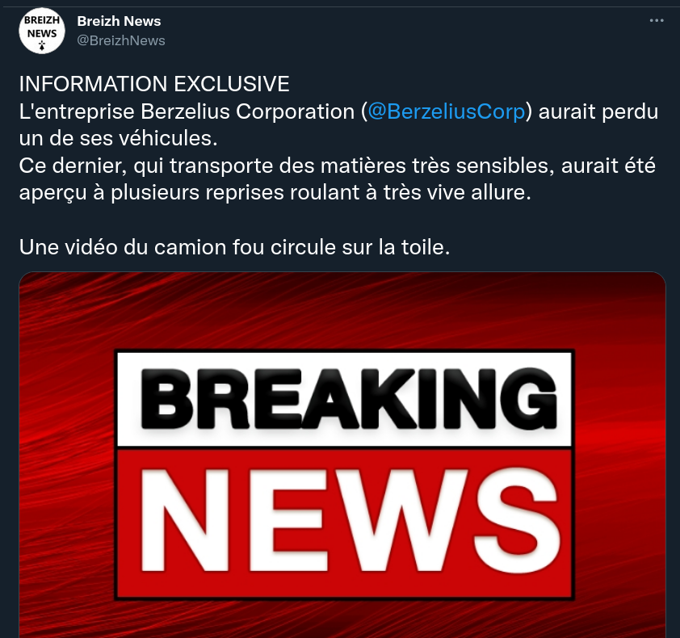

# 2) 4MM0N14C

Le PDG de Berzelius Corp vous explique  qu'un de leurs camions contenant des produits chimiques a disparu,  probablement volé. Il a essayé de garder l'information secrète mais  celle-ci a déjà fuité sur les réseaux, à cause d'un compte anonyme. Trouvez l'identifiant du compte qui a révélé l'information sur un réseau social.

## Solution

Tout part du compte Twitter de l'entreprise : https://twitter.com/BerzeliusCorp

Une simple recherche Twitter nous fait arriver assez vite à Breizh News :



## Flag

```
UYBHYS{BreizhNews}
```

