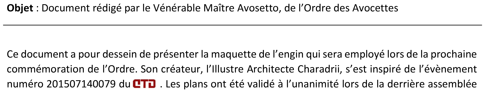
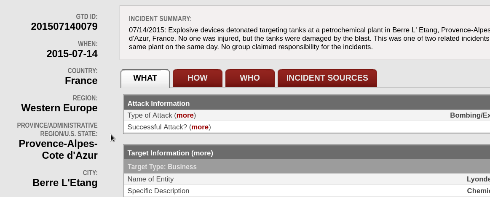

# 13) B00M 					

L'image trouvée sur le site semble faire clairement référence à un évènement ou à une attaque terroriste s'étant déjà produite en France. La police souhaite collecter davantage  d'informations via votre précieuse aide, afin de déjouer cette attaque  rapidement. Analysez les éléments fournis dans cette image dans un premier temps. Puis déterminez la ville où s'est déroulée l'attaque qui a inspiré  l'Ordre des Avocettes.

## Solution

Des plans d'un robot ou d'une machine ?!? Le paragraphe suivant en particulier a retenu notre attention.



Le numéro fait penser à une date (2015/07/14 0079). Une recherche Google : 


Le troisième résultat en particulier est intéressant : https://www.start.umd.edu/gtd/search/Results.aspx?page=2&casualties_type=&casualties_max=&country=69&count=100&expanded=no&charttype=line&chart=country&ob=GTDID&od=desc (on y retrouve le logo GTD présent dans l'image : GTD = Global Terrorism Database)

En cherchant l'identifiant présent dans l'image : https://www.start.umd.edu/gtd/search/IncidentSummary.aspx?gtdid=201507140079



L'attaque a eu lieu dans la commune de Berre l'Etang !

## Flag

```
UYBHYS{Berre l'Etang}
```

