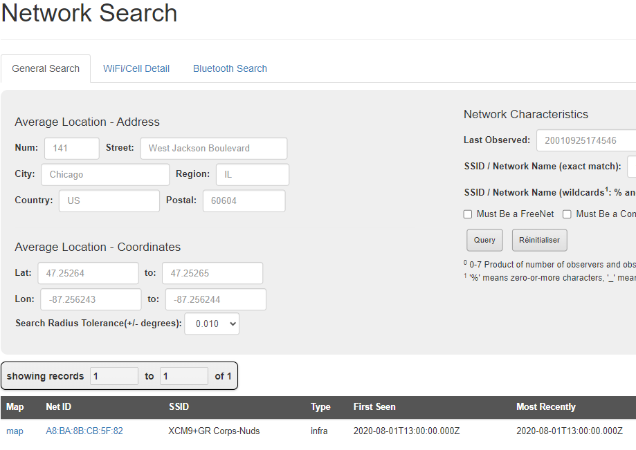
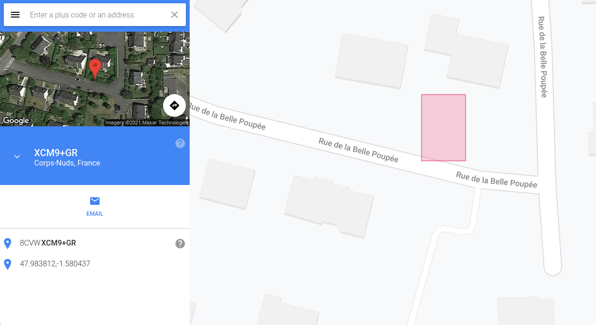

# 10) B4RB13

Vous décidez de vous rendre au café un  jeudi soir, point de rencontre habituel des membres du groupuscule pour  essayer d'en apprendre plus. Le café était vide, les auteurs ont disparu avant que vous ne puissiez  intervenir. L'une des personnes, dans sa fuite précipitée a oublié un AirTag sur  place. Après plusieurs investigations sur l'objet, votre ami Georges (adepte du forensic lors de son temps libre) parvient à obtenir une adresse MAC : *A8:BA:8B:CB:5F:82*. Il semblerait qu'il s'agisse de l'adresse MAC de l'IPhone auquel est  relié l'AirTag. Il est possible que cette adresse nous mène vers  l'endroit où les voleurs cachent le camion et les produits chimiques. A partir de ces informations, trouvez cette adresse postale.

## Solution

Assez compliqué quand on y connait rien et les indices n'aidaient pas beaucoup... Jusqu'à ce qu'on apprenne l'existence de https://wigle.net/



XCM9 fait penser à une notation proposée entre autres sur un site de Google : https://plus.codes/8CVWXCM9+GR (site évoqué par l'un des indices)



5 rue de la Belle Poupée à Corps-Nuds (ce qui fait écho au nom du challenge "barbie" en leetspeak)

## Flag

```
UYBHYS{}
```

