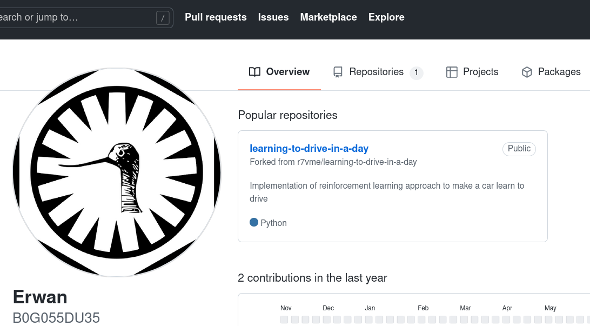

# 7) C0MM1T PU5H 4DD

A present, il vous est possible de  trouver le compte de l'un des auteurs du vol sur un service web  d'hébergement de développement de logiciels. Quelle adresse mail est liée à ce compte ?

## Solution

Les services auxquels l'énoncé peut faire reférence sont des sites tels que Github ou Gitlab par exemple.

En allant sur Github, on trouve un profile intéressant avec un seul dépôt : https://github.com/B0G055DU35



Rien de spécial dans le dépôt en lui-même, notre Erwan a fait un fork d'un dépôt existant et n'a fait que 3 commits dedans : https://github.com/B0G055DU35/learning-to-drive-in-a-day/commits/master

Cependant, à la première utilisation de Git, on est censé configurer un nom et une adresse email (https://git-scm.com/book/fr/v2/D%C3%A9marrage-rapide-Param%C3%A9trage-%C3%A0-la-premi%C3%A8re-utilisation-de-Git). Ces identifiants doivent se retrouver dans les messages de commit :

```bash
$ git clone https://github.com/B0G055DU35/learning-to-drive-in-a-day
$ cd learning-to-drive-in-a-day	
$ git log
commit 58f0c10aac7b2d8bbb871acee1e70ebae5e57cbd (HEAD -> master, origin/master, origin/HEAD)
Author: Erwan <erwanreausodu56@gmail.com>
Date:   Tue Sep 14 21:15:44 2021 +0200

    Update run-in-docker.sh
[...]
```

## Flag

```
UYBHYS{erwanreausodu56@gmail.com}
```

