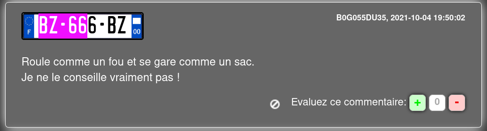

# 6) C1N3T1QU3

Vous commencez vos recherches pour  essayer de trouver des informations relatives à la plaque  d'immatriculation nouvellement apposée sur le camion. Il est possible  que la nouvelle plaque soit celle du véhicule personnel de l'un des  auteurs du vol. Évidemment, vous n’avez pas accès aux fichiers  détaillant les informations sur le propriétaire du véhicule. Cela vous  importe peu. Ce véhicule a été vu et signalé à de nombreuses reprises  sur le net. Trouvez les signalements liés à cette plaque, un alias appartenant à l'un des voleurs y apparait.

## Solution

En cherchant la plaque d'immatriculation sur Google :



## Flag

```
UYBHYS{B0G055DU35}
```

