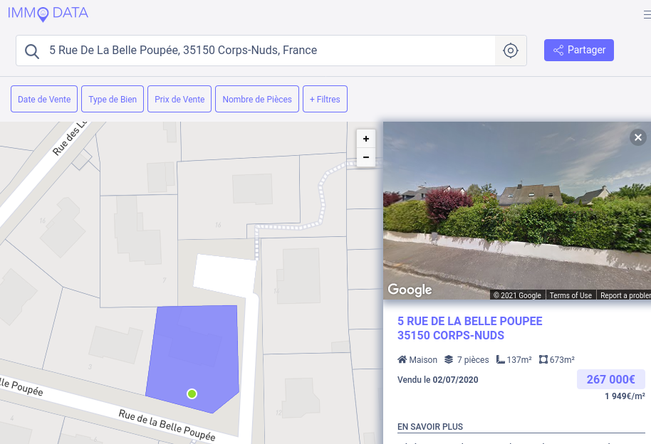

# 11) C4ILL4SS3

Vous avez réussi à géolocaliser  l'endroit où les produits chimiques ont été entassés. Les auteurs du vol ont presque tous été interpellés grâce à votre signalement. Une partie  des produits chimiques a été récupérée. Pour autant, tout n'est pas terminé. De nouvelles investigations  s'ouvrent à présent. Une information vous a été signalée, indiquant que  la vente immobilière de la demeure que vous avez trouvez dans votre  précédente investigation, avait servi à payer l'association des  avocettes. Quel est le montant de la vente de ce bien, réalisée en 2020 ?

## Solution

Inconnu au bataillon avant ce CTF, le merveilleux site https://www.immo-data.fr/. En rentrant une adresse, cela nous donne les informations sur les ventes immobilières aux alentours : 



On retrouve notre cible vendue en 2020.

## Flag

```
UYBHYS{267000}
```

