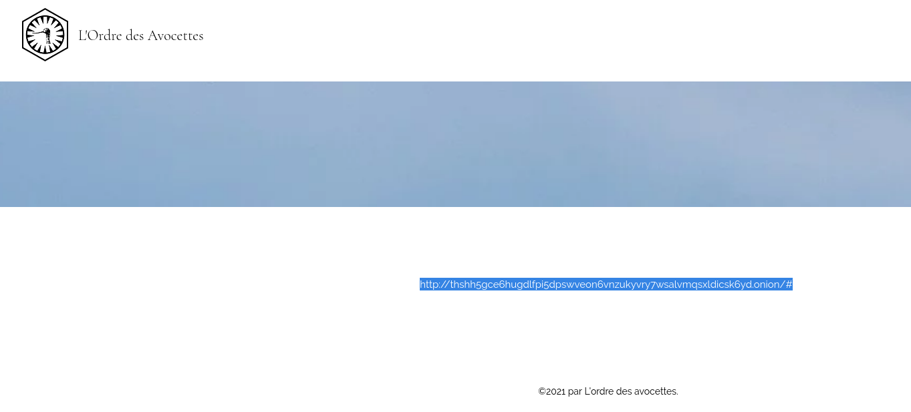

# 12) CU1CU1

L'intervention a été un franc-succès. De nombreuses personnes ont été interpellées. Cependant, tous les membres  de ce groupuscules n'était pas présents. Des investigations ont été  menées sur les lieux et sur le suivi des fonds du groupuscule. L'argent a semble-t-il été envoyé via divers cryptomonnaies. Il semble également  qu'un risque d'attentat bio-chimique existe. En effet, une attaque  serait même en cours de préparation à l'encontre de la commune La  Couyère. Un site appartenant à l'Ordre des Avocette serait accessible à partir du site originel. Quel est le nom de la seconde image apparaissant sur la page d'accueil de l'autre site (sans l'extension de l'image) ?

## Solution

Retournons sur le site de nos avocettes : https://ordredesavocettes.wixsite.com/site

Rien de spécial dans le code source des pages (en même temps, sur Wix, c'est compliqué...) sauf sur la page https://ordredesavocettes.wixsite.com/site/citation



Un site sur TOR écrit en blanc sur fond blanc. Hum...

Site offline à l'heure d'écriture du writeup mais on obtenait un site dont la deuxième image avait un nom en leetspeak qui était le flag :)

## Flag

```
UYBHYS{M1551ON_Z3R0}
```


