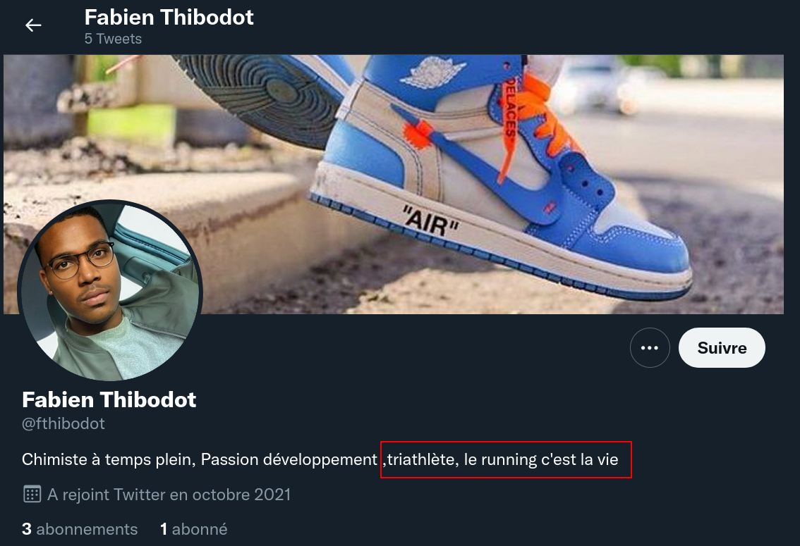

# 3) D10XYD3

Pendant vos investigations sur les  réseaux, vous êtes avertis que des témoins ont filmé le camion de la  société dans une petite ville de France. Une vidéo du camion circule sur la toile, sur un réseau social pour  les spécialistes modernes de la phonéographie. Trouvez la ville dans  laquelle est passée le camion.

## Solution

Le témoignage de Fabien Thibodot est intéressant :


Reste à trouver le village de cette personne. En regardant son profil Twitter : 



Un adepte de triathlon et de course à pied ? Allons fouiller sur Strava :


Et oui ! Coureur pas très actif (...) mais on vois qu'il habite à La Couyère, haut-lieu de ce CTF, nous le verrons dans les prochains challenges.

## Flag

```
UYBHYS{LaCouyere}
```

