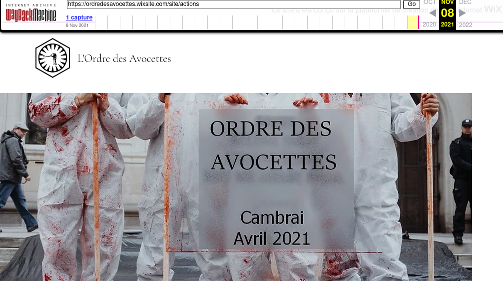

# 9) D14T0M1C

Vous avez réussi à identifier le nom du  groupe qui pourrait potentiellement être derrière le vol du camion de  Berzelius Corp contenant des produits chimiques. Ce groupuscule avait  pour habitude d'afficher leurs actions de désobéissance civile  "non-violente" sur leur site web. Il semblerait même qu'ils auraient  participé à une manifestation radicale récemment. Malheureusement, ces  actions n'apparaissent plus sur leur plateforme à présent. Dans un  premier temps, retrouvez l'endroit où ces actions pouvaient être  affichées. Trouvez l'endroit où s'est déroulée la dernière manifestation à laquelle le groupuscule a participé.

## Solution

Le site de la confrérie : https://ordredesavocettes.wixsite.com/site (site qu'on retrouve après une rapide recherche Twitter https://twitter.com/MagnoliaSauriol)

Rien de particulier dans leurs dernières actions : https://ordredesavocettes.wixsite.com/site/actions

Un petit tour dans la Wayback Machine nous donne la solution :



## Flag

```
UYBHYS{cambrai}
```

