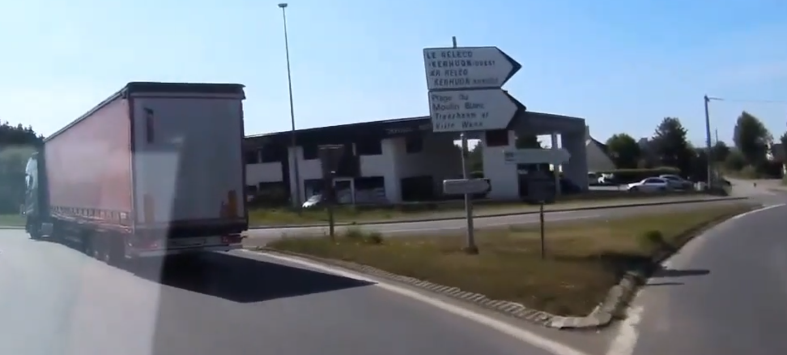

# 4) GLUC053  					

Vous avez au cours des premières  recherches identifié la ville par laquelle est passé le camion. Afin  d'en savoir plus sur les conditions du vol, vous débutez des recherches  avancées. Il vous ait rapporté que les voleurs du camion ont été aperçus dans une  boulangerie à quelques pas de l'endroit où le camion a été filmé. La vidéo complète du challenge précédent est en PJ. Trouvez dans un  premier temps le nom de la boulangerie. Quel est le nom de l'ancien  co-gérant de cette enseigne ?

## Solution

Voici un screenshot de la dashcam :



Etant dans la métropole brestoise, on reconnait assez facilement le rond point de Poul Ar Feunteun et la boulangerie "Le Moulin de l'Iroise" :


[societe.com](https://www.societe.com) nous donne le nom de la propriétaire actuelle : https://www.societe.com/societe/le-moulin-de-l-iroise-800483505.html.

En recherchant ce nom sur Google, on retrouve le nom de l'ancien co-gérant : https://annonces-legales.actu.fr/finistere/demission-de-co-gerant_498287

## Flag

```
UYBHYS{couloigner}
```

