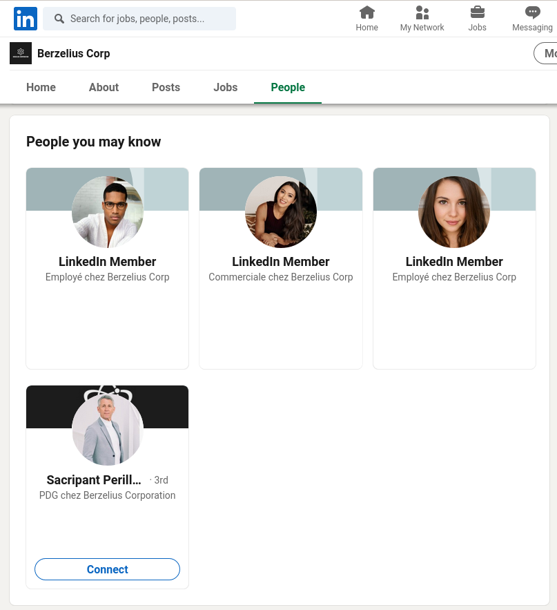
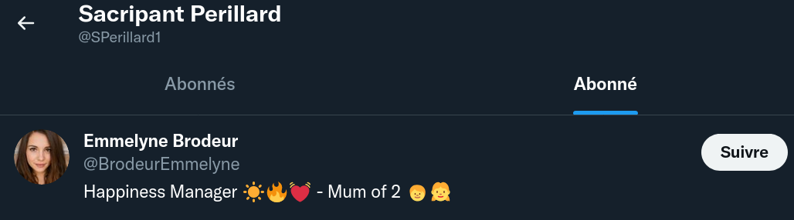
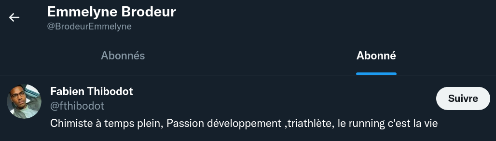
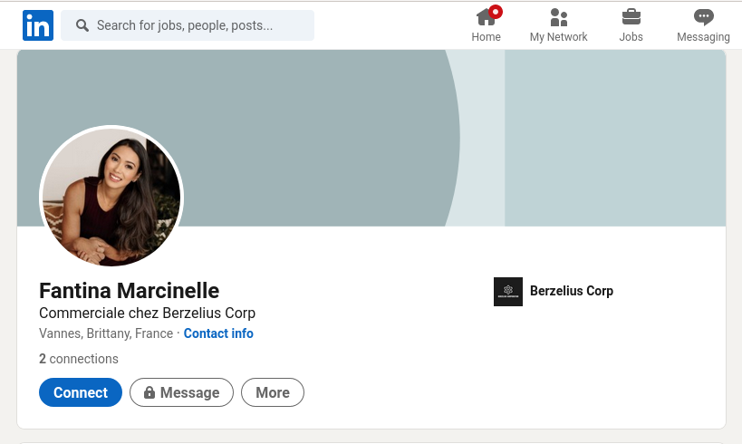

# 1) M3TH4N0L

Le lundi matin à 9h, vous avez encore la tête dans le cul. Votre café est tiède. Votre concierge a encore joué  de la musique toute la nuit.

Vous arrivez à votre agence de détective  privé l'air dépité et fatigué. Le téléphone sonne. Cette douce musique  vous rappelle que vous êtes un boomer avec un téléphone fixe. Vous  répondez et découvrez une petite voix fluette. Il s'agit de Monsieur  Sacripant PERILLARD, PDG de la société Berzelius Corp. 

Celui-ci est  littéralement en panique. Il hurle sur vous pour que vous veniez  l'aider. Sans trop comprendre de quoi il retourne, vous vous dirigez  avec votre imperméable vert en direction de la société Berzelius Corp,  célèbre usine de produit chimique. Cette histoire semble louche, mais  elle paye les factures. Vous profitez du trajet sous la pluie (normal en Bretagne) pour vous renseigner un peu sur la société Berzelius. Le flag est la concaténation des prénoms de tous les employés de la  société, classés dans l'ordre alphabétique (sans le prénom du PDG). *Format de flag : UYBHYS{PrenomPrenom...}*

## Solution

Un petit tour sur Linkedin nous donne la liste de nos cibles : 



Problème : on a le nom du PDG (Sacripant Perillard) mais pas celui des trois employés qui constituent le flag...

Le compte Twitter du PDG nous donne le nom d'une collaboratrice (Emmelyne Brodeur) :



A partir du compte Twitter d'Emmelyne, on trouve Fabien Thibodot :



En cherchant un(e) commercial(e), on trouve Fantina Marcinelle :



## Flag

```
UYBHYS{emmelynefabienfantina}
```

