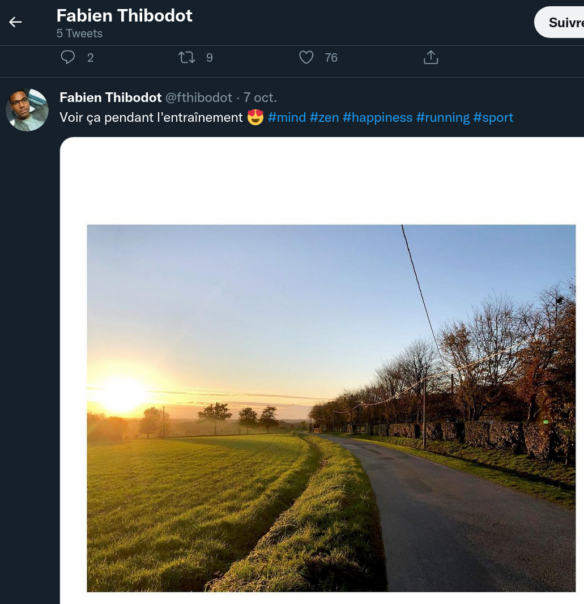
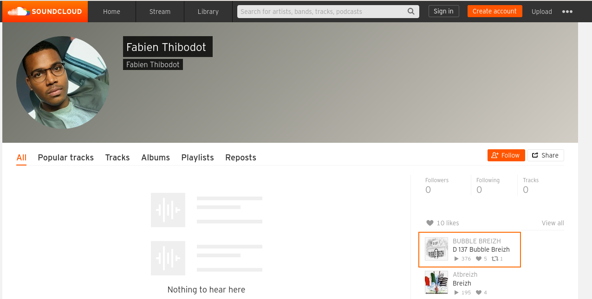
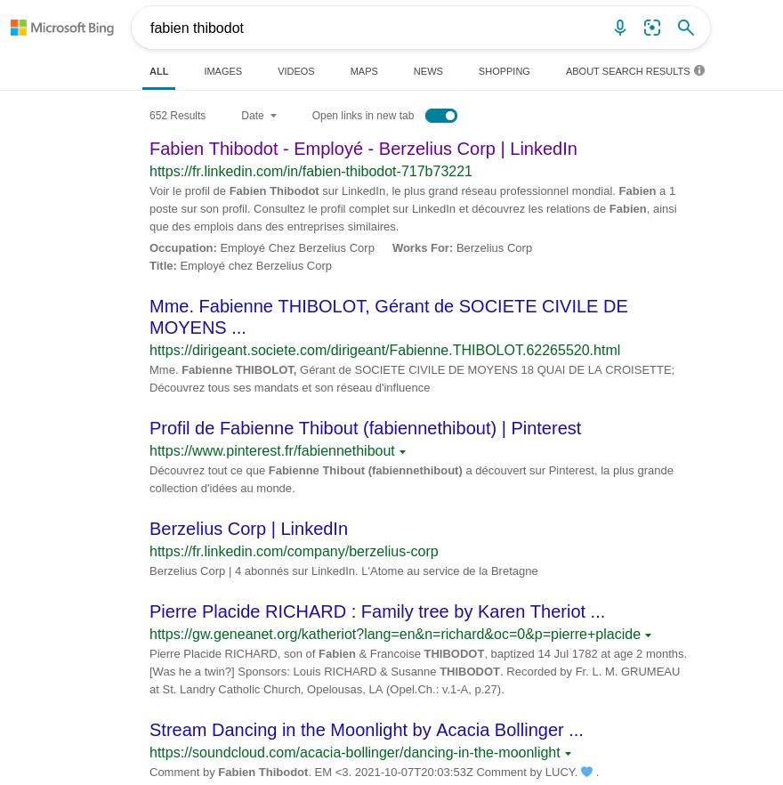

# On the road again

Dans cette entreprise il y a plein de  gars très bien, dont Fabien. Fabien c'est un gars bien. Il est cool et  doux. Le genre de personne à aimer la nature. Sauriez-vous découvrir l'itinéraire préféré de Fabien ? Pour ainsi l'accompagner dans des passionnantes ballades.

## Solution

De mon point de vue, le plus capillotracté, sans les indices. Notre cible ici est Fabien. Fabien est sportif mais n'a rien enregistré sur Strava... https://www.strava.com/athletes/93721587. Au premier abord, ça parait compliqué de connaître son circuit de course favori....

Sur son Twitter (https://twitter.com/fthibodot) :



Pas d'indication particulière qui permettrait de localiser cette route. Mon équipe a même commencé à regarder la carte du réseau électrique autour de la commune de la Couyère ! https://www.rte-france.com/carte-reseau-transport-electricite

Ici, les indices étaient de bonne aide :

- La route que Fabien emprunte lors de sa balade préférée l'amène face à la mer, où il aurait dû grandir (tiens, ça fait penser à une chanson de Calogero et Passi).
- Elle court, elle court, la maladie d'amour mais pas sur le compte  Strava de Fabien, il n'a donc pas pu partager son itinéraire préféré sur cette application. Il faut donc chercher ailleurs afin de trouver sa balade préférée (là encore, on reconnait du Sardou).
- Tout en savourant son Bubble Tea, Fabien en profite pour écouter la ballade qu'il a dédié à son crush, EM. Il repense à ce concert d'un groupe local, qu'ils écoutaient lors de  leur sortie à Saint Malo, surtout à cette ballade de folk rock... (EM comme Eddy Mitchell ?)

Entre temps, le bon Fabien a tweeté une chanson d'Eddy Mitchell https://twitter.com/fthibodot/status/1459223252895739909

Cela fait beaucoup d'indices autour de la musique sans compter le titre du challange (on the road again) et surtout le texte : 

> Pour ainsi l'accompagner dans des passionnantes ba**ll**ades.

Et non, ce n'est pas une faute d'orthographe. Fabien part en balade avec des ballades. Autrement dit, il y a fort à parier qu'il utilise un site de musique pour aller courir.

- Deezer et Spotify ne donnent rien...
- Il aura fallu attendre la fin du CTF pour se rappeler qu'un troisième existe : c'est Soundcloud !



Fabien a un profil Soundcloud vide mais il a surtout liké une chanson "D137" de Bubble Breizh.

D137 qui relie Rennes à Saint-Malo et qui longe le fort de Saint-Père, lieu de la célèbre "Route du Rock" https://www.laroutedurock.com/

La boucle musicale était bouclée !

## Note

A se rappeler pour les prochaines fois, il n'y a pas que Google comme moteur de recherche. Bing et Duckduckgo renvoyaient la piste Soundcloud plus rapidement...



## Flag

```
UYBHYS{D137}
```

