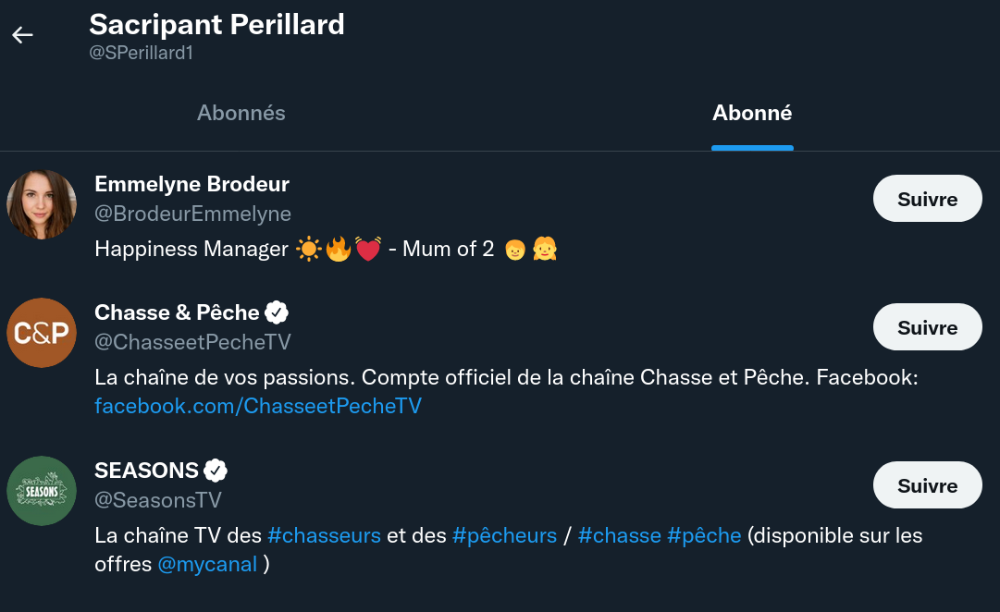
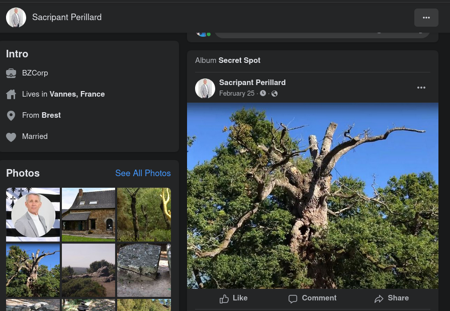
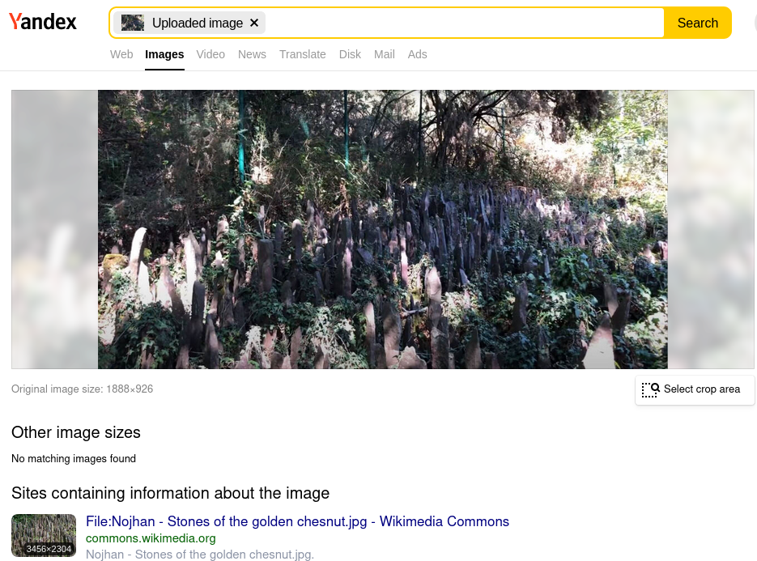

# Secret mal gardé 					

C'est la pleine lune, le moment où les  amoureux se tournent autour. Là il s'agit de chasse. C'est différent.  Mais on peut aimer ce qu'on mange, vous ne pensez pas ? Il y a deux types de chasseur dans la vie. Le bon chasseur, et le  mauvais chasseur. Je crois avoir oublié la suite... Il paraît que monsieur Sacripant à un coin de chasse qu'il garde pour lui. Un coin secret. Trouvez la localisation de celui-ci. Je vous  promets qu'il n'en saura rien !

## Solution

Revenons sur la cible suivante : le patron de l'entreprise Berzelius https://twitter.com/sPerillard1



Celui-ci est bien adepte de chasse.

Sur son profil Facebook, on retrouve un album "spot secret" :



Des arbres, des cairns et un amas de "cailloux" qui parait un peu plus particulier. Si on passe cette image dans Yandex : 



Il s'agit de pierres à proximité de l'arbre d'or dans la forêt de Brocéliande https://commons.m.wikimedia.org/wiki/File:L_arbre_d_or_Paimpont.JPG

## Flag

```
UYBHYS{Brocéliande}
```

